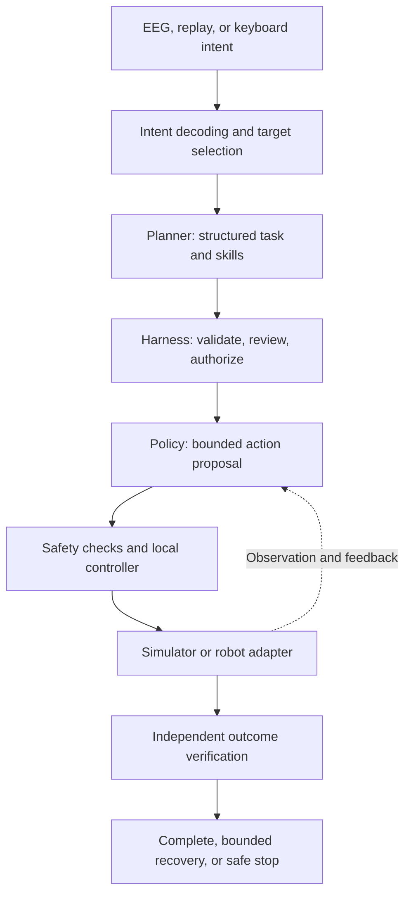

# Synapse2Action / 念动

**From neural intent to safe, verifiable robotic action.**

English · [简体中文](README.zh-CN.md)

[Quick start](#quick-start) · [Architecture](#architecture) · [Documentation](#documentation) · [Contributing](CONTRIBUTING.md) · [MIT License](LICENSE)

Synapse2Action is an open-source research framework connecting brain-computer interfaces, language planning, and robot control. It turns sparse human intent into a concrete plan that can be reviewed, confirmed, executed, and checked against measured results.

The human chooses the goal and retains control. The robot handles perception, planning, and movement. EEG is a high-level channel for **select, confirm, cancel, and stop**, while local controllers manage continuous motion.

The project is for researchers and engineers working on shared autonomy, embodied AI, and reproducible robot experiments. You can start with a deterministic demo on a CPU, without an EEG device, a model service, or a robot.

> **Research status:** The hardware-free core is implemented. Real model and simulator integrations remain experimental; reliable physical-robot task completion has not been demonstrated. See [current challenges](docs/current-challenges.md) for the measured gaps and next decisions.

## What you can build

- **Intent-driven workflows:** turn synthetic signals, recorded EEG, or keyboard input into explicit task selection and confirmation.
- **Reviewable robot plans:** connect a language planner to typed skills, world-state validation, and context-bound authorization.
- **Replaceable action policies:** evaluate scripted policies and VLA adapters through bounded action contracts.
- **Closed-loop experiments:** connect perception, action, and feedback through local, HTTP, ROS 2, and Unitree research adapters.
- **Evidence-based evaluation:** record traces, replay episodes, compare policies, and separate task success from process compliance and safety.

An example task is moving a selected object into a target zone. The user selects the object, reviews the plan, and confirms it. The policy supplies actions, the robot executes them, and a separate verifier checks the outcome. Cancellation, emergency stop, and bounded recovery have explicit state-machine paths.

## Architecture



| Component | Responsibility |
| --- | --- |
| Intent interface | Decode sparse commands and track confidence, timing, and target context. |
| Planner | Produce a structured plan using the available skills. |
| Harness | Own task state, confirmation, authorization, cancellation, and bounded recovery. |
| Policy adapter | Convert a confirmed task and observations into action proposals. |
| Controller and robot adapter | Apply configured limits, execute commands, and return measured state. |
| Verifier and evidence layer | Check outcomes independently and preserve the inputs, versions, and traces behind a result. |

Generative models propose plans and actions. Deterministic layers retain authority over configured limits, authorization, stop paths, and the final success verdict. Available checks depend on the adapter; physical emergency-stop behavior and full collision enforcement require separate validation.

[LeRobot](https://github.com/huggingface/lerobot) is the selected robot-learning foundation. The migration of policy, processor, and normalization operations to that boundary is still in progress. Synapse2Action focuses on intent, orchestration, authorization, and evidence. Read the [engineering philosophy](docs/engineering-philosophy.md) and [policy lifecycle](docs/policy-routing.md) for the design boundaries.

## Quick start

### Requirements

- Python **3.12 or newer** and Git.
- No third-party runtime dependencies for the hardware-free core.
- Run the commands below from the repository root. Model and simulator integrations have separate environments and dependencies.

```bash
git clone https://github.com/ZacharyZcR/Synapse2Action.git
cd Synapse2Action

PYTHONPATH=src python3 -m synapse2action --demo
```

This runs a deterministic pick-and-place demonstration using synthetic EEG, a mock planner, a scripted policy, and a simulated tabletop robot. The JSON output contains the task result and execution trace.

### Generate a visual report

```bash
mkdir -p artifacts
PYTHONPATH=src python3 -m synapse2action --demo \
  --demo-html artifacts/demo.html --output artifacts/demo.json
```

Open `artifacts/demo.html` in your browser to inspect the demonstration and its trace.

### Run the scenario suite

```bash
PYTHONPATH=src python3 -m synapse2action \
  --demo-suite experiments/demos \
  --artifact-directory artifacts/demo-suite \
  --output artifacts/demo-suite.json
```

The suite covers pick-and-place, cancellation, and emergency-stop scenarios. Its results describe the bundled hardware-free environment.

### Validate the repository

```bash
PYTHONPATH=src python3 simulation/run_cpu_ci.py --report reports/cpu-ci.json
```

The same command is used by [CPU CI](.github/workflows/cpu-ci.yml). It runs the test suite and checks the research release manifest, returning a nonzero exit status on failure. Some tests create temporary loopback HTTP servers. See [deployment profiles](docs/deployment-profiles.md) for the exact scope of each validation environment.

For additional commands, run `PYTHONPATH=src python3 -m synapse2action --help`.

## Integrations and current scope

| Area | Available work | Current boundary |
| --- | --- | --- |
| Human intent | Synthetic SSVEP signals, EEG recording/replay, keyboard input | Offline and synthetic results do not establish live human BCI performance. |
| Language planning | Mock planner and an OpenAI-compatible Chat Completions adapter | Plans must use supported skills and pass Harness validation. |
| Action policies | Scripted policies, learned navigation baselines, GR00T and SmolVLA research paths, OpenPI adapter | Embodiment mapping and task-specific qualification remain necessary. |
| Robot interfaces | Local and HTTP transports, ROS 2 bindings, Unitree SDK2/G1 simulation work | Simulation and transport tests do not establish physical-G1 readiness. |
| Evaluation | Deterministic suites, episode replay, policy admission, evidence manifests | Admission checks require actual matching policy and language evidence. |

The current physical-simulation bottleneck is reliable grasp, lift, and transport. Language causality, recovery effectiveness, and transfer to a physical G1 also remain open. See the [industrialization gap](docs/industrialization-gap.md) for the active milestones and reported experimental results.

Large model weights, third-party source trees, raw EEG derivatives, and local simulation recordings are **not included** in a clone. The [research release catalog](docs/research-release.md), [model cards](docs/model-cards/policy-models.md), and [data cards](docs/data-cards/research-data.md) identify what is published and what must be obtained separately.

## Documentation

| Start here | Contents |
| --- | --- |
| [Engineering philosophy](docs/engineering-philosophy.md) | Intent, cognition, action, and control responsibilities. |
| [Hardware-free experiments](docs/pre-simulation.md) | What can be exercised before external simulation. |
| [Experiment protocols](docs/experiments.md) | Scenarios, measurements, and acceptance gates. |
| [Simulation guide](simulation/README.md) | Model adapters, EEG experiments, ROS 2, and Unitree integration. |
| [Ubuntu whole-body simulation](docs/ubuntu-whole-body-simulation.md) | Environment setup and whole-body research workflows. |
| [Policy routing and lifecycle](docs/policy-routing.md) | Capability matching, admission, and switching. |
| [Research release catalog](docs/research-release.md) | Published assets, hashes, and excluded material. |
| [References and dependencies](docs/references.md) | Upstream projects and their integration status. |
| [Current challenges](docs/current-challenges.md) | Known failures and next decisions. |

## Roadmap

1. Isolate the measured post-grasp lift failure with controlled, matched-seed experiments.
2. Complete the LeRobot adapter boundary and qualify a second mature policy under the same evidence contract.
3. Demonstrate language causality across multiple tasks and measure bounded recovery.
4. Begin supervised physical-G1 preflight, then progress through separately verified execution gates.

Detailed milestones live in the [delivery plan](docs/industrialization-gap.md#active-delivery-plan--当前交付路线).

## Contributing

Contributions to reproducible experiments, adapters, failure analysis, and documentation are welcome. Start with the [contribution guide](CONTRIBUTING.md); use [GitHub issues](https://github.com/ZacharyZcR/Synapse2Action/issues) for bugs and proposals. Keep changes focused and include the evidence needed to reproduce their behavior.

Project responsibilities and participation rules are described in [Governance](GOVERNANCE.md), [Security](SECURITY.md), [Privacy](PRIVACY.md), and [Responsible Use](RESPONSIBLE_USE.md). Follow the security policy when reporting sensitive issues.

## License

Synapse2Action is licensed under the [MIT License](LICENSE).

Third-party code, datasets, model weights, and recordings retain their respective licenses and terms. Referencing or integrating those assets does not relicense them under MIT.
