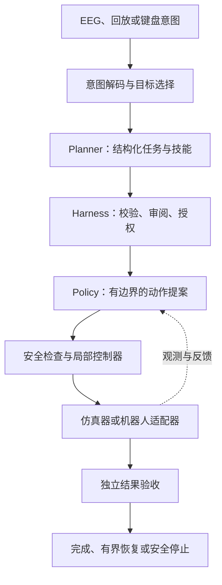

# Synapse2Action / 念动

**从神经意图到安全、可验证的机器人动作。**

[English](README.md) · 简体中文

[快速开始](#快速开始) · [架构](#架构) · [文档](#文档) · [参考文献](#致谢与参考文献) · [引用本项目](#引用-synapse2action) · [参与贡献](CONTRIBUTING.md) · [MIT 许可证](LICENSE)

Synapse2Action（念动）是连接脑机接口、语言规划与机器人控制的开源研究框架。它将稀疏的人类意图转化为具体计划，让任务能够被审阅、确认、执行，并通过实测结果验收。

人负责选择目标并保留控制权，机器人负责感知、规划与运动。EEG 提供**选择、确认、取消、停止**等高层指令，连续运动由局部控制器管理。

项目面向共享自主、具身智能与可复现机器人实验领域的研究者和工程师。无需 EEG 设备、模型服务或机器人，就能在 CPU 上运行确定性演示。

> **研究状态：** 无设备核心已实现。真实模型与仿真器集成仍处于实验阶段，尚未证明能够可靠完成真机任务。实测差距与下一步决策见[当前挑战](docs/current-challenges.md)。

## 可以用它做什么

- **意图驱动的任务流程：** 将合成信号、已录制 EEG 或键盘输入转化为明确的任务选择与确认。
- **可审阅的机器人计划：** 将语言规划器接入类型化技能、世界状态校验与上下文绑定授权。
- **可替换的动作策略：** 通过有边界的动作契约评估固定策略与 VLA 适配器。
- **闭环实验：** 通过本地、HTTP、ROS 2 和 Unitree 研究适配器连接感知、动作与反馈。
- **基于证据的评估：** 记录轨迹、回放 Episode、比较策略，并分别判定任务成功、流程合规与安全。

一个示例任务是把选中的物体移动到目标区域。用户选择物体、审阅计划并确认；Policy 提供动作，机器人执行，独立 Verifier 检查结果。取消、急停与有界恢复都有明确的状态机路径。

## 架构



| 组件 | 职责 |
| --- | --- |
| 意图接口 | 解码稀疏指令，跟踪置信度、时序与目标上下文。 |
| Planner | 使用可用技能生成结构化计划。 |
| Harness | 管理任务状态、确认、授权、取消与有界恢复。 |
| Policy 适配器 | 将已确认任务与观测转化为动作提案。 |
| 控制器与机器人适配器 | 应用配置的限制，执行指令并返回实测状态。 |
| Verifier 与证据层 | 独立检查结果，保留支撑结果的输入、版本与轨迹。 |

生成式模型提出计划和动作；确定性层保留对配置限制、授权、停止路径与最终成功判定的控制权。具体可用检查取决于适配器，实体急停行为与完整碰撞约束需要单独验证。

[LeRobot](https://github.com/huggingface/lerobot) 是项目选定的机器人学习基础设施，Policy、Processor 与 Normalization 操作向这一边界的迁移仍在进行。Synapse2Action 聚焦意图、编排、授权与证据。设计边界详见[工程哲学](docs/engineering-philosophy.md)和[策略生命周期](docs/policy-routing.md)。

## 快速开始

### 环境要求

- Python **3.12 或更高版本**，以及 Git。
- 无设备核心没有第三方运行时依赖。
- 以下命令均在仓库根目录执行。模型与仿真器集成使用独立环境及依赖。

```bash
git clone https://github.com/ZacharyZcR/Synapse2Action.git
cd Synapse2Action

PYTHONPATH=src python3 -m synapse2action --demo
```

该命令使用合成 EEG、Mock Planner、固定策略和模拟桌面机器人，运行确定性的抓取放置演示。JSON 输出包含任务结果与执行轨迹。

### 生成可视化报告

```bash
mkdir -p artifacts
PYTHONPATH=src python3 -m synapse2action --demo \
  --demo-html artifacts/demo.html --output artifacts/demo.json
```

用浏览器打开 `artifacts/demo.html`，查看演示过程与执行轨迹。

### 运行场景套件

```bash
PYTHONPATH=src python3 -m synapse2action \
  --demo-suite experiments/demos \
  --artifact-directory artifacts/demo-suite \
  --output artifacts/demo-suite.json
```

套件覆盖抓取放置、取消与急停场景，结果仅描述内置无设备环境中的行为。

### 验证仓库

```bash
PYTHONPATH=src python3 simulation/run_cpu_ci.py --report reports/cpu-ci.json
```

[CPU CI](.github/workflows/cpu-ci.yml) 使用同一命令。它运行测试套件并校验研究发布清单，失败时返回非零退出码。部分测试会创建临时 Loopback HTTP 服务。各验证环境的精确边界见[部署配置](docs/deployment-profiles.md)。

更多命令可通过 `PYTHONPATH=src python3 -m synapse2action --help` 查看。

## 集成与当前能力边界

| 领域 | 已有工作 | 当前边界 |
| --- | --- | --- |
| 人类意图 | 合成 SSVEP 信号、EEG 录制与回放、键盘输入 | 离线与合成结果不能证明实时真人脑机接口性能。 |
| 语言规划 | Mock Planner 与兼容 OpenAI Chat Completions 的适配器 | 计划必须使用受支持技能，并通过 Harness 校验。 |
| 动作策略 | 固定策略、学习式导航基线、GR00T 与 SmolVLA 研究链路、OpenPI 适配器 | 仍需完成本体映射与任务专用验收。 |
| 机器人接口 | 本地与 HTTP 传输、ROS 2 绑定、Unitree SDK2/G1 仿真工作 | 仿真与传输测试不能证明 G1 真机已就绪。 |
| 评估 | 确定性套件、Episode 回放、策略准入、证据清单 | 准入检查需要真实且相互匹配的策略与语言证据。 |

当前物理仿真的瓶颈是可靠抓取、抬升与运输。语言因果性、恢复有效性和 G1 真机迁移也尚待解决。当前里程碑与已报告实验结果见[工业化差距](docs/industrialization-gap.md)。

大型模型权重、第三方源码树、原始 EEG 衍生产物与本地仿真记录**不随仓库克隆提供**。[研究发布清单](docs/research-release.md)、[模型卡](docs/model-cards/policy-models.md)和[数据卡](docs/data-cards/research-data.md)明确列出已发布内容与需单独获取的资产。

## 文档

| 入口 | 内容 |
| --- | --- |
| [工程哲学](docs/engineering-philosophy.md) | 意图、认知、动作与控制的职责划分。 |
| [无设备实验](docs/pre-simulation.md) | 接入外部仿真前可验证的行为。 |
| [实验协议](docs/experiments.md) | 场景、测量指标与验收门槛。 |
| [仿真指南](simulation/README.md) | 模型适配器、EEG 实验、ROS 2 与 Unitree 集成。 |
| [Ubuntu 全身仿真](docs/ubuntu-whole-body-simulation.md) | 环境配置与全身控制研究流程。 |
| [策略路由与生命周期](docs/policy-routing.md) | 能力匹配、准入与切换。 |
| [研究发布清单](docs/research-release.md) | 已发布资产、哈希与排除项。 |
| [参考材料与依赖](docs/references.md) | 上游项目及其集成状态。 |
| [当前挑战](docs/current-challenges.md) | 已知失败与下一步决策。 |

## 路线图

1. 用受控、相同 Seed 的实验定位实测抓取后抬升失败。
2. 完成 LeRobot 适配边界，让第二个成熟策略通过相同证据契约的验收。
3. 在多个任务上证明语言因果性，并测量有界恢复效果。
4. 开始受监督的 G1 真机预检，再逐步通过独立验证的执行门槛。

详细里程碑见[交付计划](docs/industrialization-gap.md#active-delivery-plan--当前交付路线)。

## 致谢与参考文献

Synapse2Action 建立在开源机器人与生物信号软件之上，并参考了下列研究。感谢这些项目的作者与维护者。具体集成状态及版本锁定信息见[完整参考材料与依赖登记](docs/references.md)。

### 上游仓库

| 领域 | 仓库与资产 | 在本项目中的作用 |
| --- | --- | --- |
| 机器人学习 | [LeRobot](https://github.com/huggingface/lerobot)、[SmolVLA](https://huggingface.co/lerobot/smolvla_base) | 数据集、训练与策略运行时基础设施。 |
| 人形 VLA | [Isaac GR00T](https://github.com/NVIDIA/Isaac-GR00T)、[GR00T Whole-Body Control](https://github.com/NVlabs/GR00T-WholeBodyControl)、[GEAR-SONIC](https://huggingface.co/nvidia/GEAR-SONIC) | VLA 与全身控制研究链路；完整 SONIC 链路仍待完成。 |
| 替代策略 | [OpenPI](https://github.com/Physical-Intelligence/openpi) | 研究适配器与策略服务参考。 |
| 机器人接口 | [Unitree SDK2](https://github.com/unitreerobotics/unitree_sdk2)、[SDK2 Python](https://github.com/unitreerobotics/unitree_sdk2_python)、[unitree_mujoco](https://github.com/unitreerobotics/unitree_mujoco) | G1 指令与状态契约、仿真桥接。 |
| 移动与跟踪 | [unitree_rl_lab](https://github.com/unitreerobotics/unitree_rl_lab)、[unitree_rl_gym](https://github.com/unitreerobotics/unitree_rl_gym)、[OpenWBT](https://github.com/GalaxyGeneralRobotics/OpenWBT)、[OpenTrack](https://github.com/GalaxyGeneralRobotics/OpenTrack) | 移动控制基线与已暂存的全身控制对照候选。 |
| 仿真与中间件 | [MuJoCo](https://github.com/google-deepmind/mujoco)、[ROS 2 / rclpy](https://github.com/ros2/rclpy)、[Cyclone DDS](https://github.com/eclipse-cyclonedds/cyclonedds) | 物理仿真、机器人中间件与传输。 |
| EEG 与采集 | [BrainFlow](https://github.com/brainflow-dev/brainflow)、[Lab Streaming Layer](https://github.com/sccn/labstreaminglayer)、[WFDB Python](https://github.com/MIT-LCP/wfdb-python)、[MAMEM SSVEP 数据](https://physionet.org/content/mssvepdb/) | 采集、流同步与离线 EEG 实验。 |

### 主要论文

- [SmolVLA: A Vision-Language-Action Model for Affordable and Efficient Robotics](https://arxiv.org/abs/2506.01844) — 紧凑 VLA 与异步推理。
- [GR00T N1: An Open Foundation Model for Generalist Humanoid Robots](https://arxiv.org/abs/2503.14734) — 人形 VLA 架构。
- [SONIC: Supersizing Motion Tracking for Natural Humanoid Whole-Body Control](https://arxiv.org/abs/2511.07820) — 运动跟踪与全身控制。
- [π0](https://arxiv.org/abs/2410.24164) 与 [π0.5](https://arxiv.org/abs/2504.16054) — 通用动作策略与开放世界泛化。
- [Unleashing Humanoid Reaching Potential via Real-world-Ready Skill Space](https://arxiv.org/abs/2505.10918) 与 [Track Any Motions under Any Disturbances](https://arxiv.org/abs/2509.13833) — 全身技能空间与运动跟踪参考。
- [RoboArena: Distributed Real-World Evaluation of Generalist Robot Policies](https://proceedings.mlr.press/v305/atreya25a.html) — 分布式评估方法。
- [Filter bank canonical correlation analysis for implementing a high-speed SSVEP-based brain–computer interface](https://doi.org/10.1088/1741-2560/12/4/046008) — FBCCA 解码方法。

其他软件库、数据集与设计参考见[完整登记表](docs/references.md)。请根据实际使用的组件和数据引用对应上游工作；列入此处不表示本项目已复现其结果，也不代表获得其作者背书。

## 引用 Synapse2Action

如果在研究中使用本框架，请使用引用键 **`zacharyzcr2026synapse2action`** 引用本软件。[CITATION.cff](CITATION.cff) 提供引用元数据，也可下载 [BibTeX 条目](CITATION.bib)：

```bibtex
@misc{zacharyzcr2026synapse2action,
  author       = {ZacharyZcR and {Synapse2Action contributors}},
  title        = {{Synapse2Action}: From Neural Intent to Safe, Verifiable Robotic Action},
  year         = {2026},
  howpublished = {GitHub},
  url          = {https://github.com/ZacharyZcR/Synapse2Action},
  note         = {Research software}
}
```

项目以仓库 URL 标识，目前没有 DOI。为保证可复现性，请同时记录实验使用的精确 Git Commit 或 Release Tag。

## 参与贡献

欢迎贡献可复现实验、适配器、失败分析与文档。请先阅读[贡献指南](CONTRIBUTING.md)，通过 [GitHub Issues](https://github.com/ZacharyZcR/Synapse2Action/issues) 提交问题与提案。保持改动聚焦，并提供复现行为所需的证据。

项目职责与参与规则见[治理](GOVERNANCE.md)、[安全](SECURITY.md)、[隐私](PRIVACY.md)和[负责任使用](RESPONSIBLE_USE.md)。敏感问题请遵循安全政策报告。

## 许可证

Synapse2Action 原创代码使用 [MIT 许可证](LICENSE)。
改编的 Unitree C++ 控制器以 Apache-2.0 分发，来源与随附许可证见[第三方声明](THIRD_PARTY_NOTICES.md)。

第三方代码、数据集、模型权重与记录仍遵循各自的许可证及条款。引用或集成这些资产，不会将其重新许可为 MIT。
